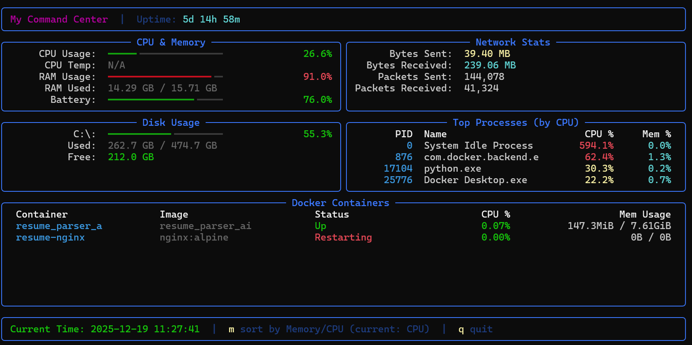

# My Command Center

A terminal-based system monitoring dashboard that provides real-time visibility into your Windows system's performance and resources.

## Screenshot



*The dashboard displaying real-time system metrics including CPU, RAM, disk usage, network stats, running processes, and Docker containers.*

## Features

### System Performance Monitoring
- **CPU Usage**: Real-time CPU percentage with color-coded alerts (red >80%, green <80%)
- **RAM Usage**: Memory consumption with percentage and GB breakdown
- **CPU Temperature**: Sensor-based temperature monitoring (when available)
- **Battery Status**: Charge percentage, charging state indicator, and time remaining
- **System Uptime**: Days, hours, and minutes since last boot

### Disk Monitoring
- Multi-disk partition support with automatic detection
- Individual usage percentages per disk
- Used/Total space display in GB
- Free space tracking with color-coded alerts:
  - Red: <10GB free
  - Yellow: <50GB free
  - Green: >50GB free

### Network Statistics
- Total bytes sent and received since startup
- Packet count (sent and received)
- Auto-formatted units (B, KB, MB, GB, TB, PB)

### Process Monitoring
- Top 5 processes ranked by CPU or Memory usage
- Process ID (PID) display
- Process name with CPU and Memory percentages
- Toggle sorting between CPU and Memory with 'm' key

### Docker Container Management
- Running container list with names and images
- Container status display (Up, Exited, etc.)
- CPU and Memory usage per container
- Status-based color coding (green for running, red for stopped)
- Graceful fallback when Docker is not installed/running

### User Interface
- Beautiful Rich TUI with multi-panel layout
- Progress bars for CPU, RAM, Battery, and Disk usage
- Color-coded visual indicators based on performance thresholds
- Live refresh every 2 seconds
- Current time display in footer

## Keyboard Controls

| Key | Action |
|-----|--------|
| `m` | Toggle process sorting between CPU and Memory |
| `q` | Quit the application |

## Requirements

- Python 3.x
- Windows OS

## Dependencies

| Package | Purpose |
|---------|---------|
| psutil | System and process monitoring |
| rich | Terminal UI and formatting |

## Installation

1. Clone or download this repository
2. Create a virtual environment:
   ```bash
   python -m venv venv
   ```
3. Activate the virtual environment:
   ```bash
   venv\Scripts\activate
   ```
4. Install dependencies:
   ```bash
   pip install psutil rich
   ```

## Usage

### Option 1: Run the batch file
Double-click `My Dashboard.bat` to launch the dashboard.

### Option 2: Run directly with Python
```bash
python main.py
```

## Dashboard Layout

```
+--------------------------------------------------+
|                  HEADER (Title + Uptime)         |
+------------------------+-------------------------+
|   CPU & Memory Panel   |    Network Stats Panel  |
|   - CPU Usage          |    - Bytes Sent         |
|   - RAM Usage          |    - Bytes Received     |
|   - Temperature        |    - Packets Sent       |
|   - Battery Status     |    - Packets Received   |
+------------------------+-------------------------+
|   Disk Usage Panel     |   Top Processes Panel   |
|   - Drive C:           |    - PID, Name          |
|   - Drive D:           |    - CPU%, Memory%      |
|   - etc.               |                         |
+------------------------+-------------------------+
|              Docker Containers Panel             |
|    Container Name | Image | Status | CPU | Mem   |
+--------------------------------------------------+
|            FOOTER (Time + Controls)              |
+--------------------------------------------------+
```

## Color Coding

| Metric | Red | Yellow | Green |
|--------|-----|--------|-------|
| CPU Usage | >80% | - | <80% |
| RAM Usage | >80% | - | <80% |
| Temperature | >80°C | >60°C | <60°C |
| Battery | <20% | <50% | >50% |
| Disk Free Space | <10GB | <50GB | >50GB |
| Process CPU | >50% | >20% | <20% |
| Process Memory | >50% | >20% | <20% |

## License

This project is open source and available for personal use.
